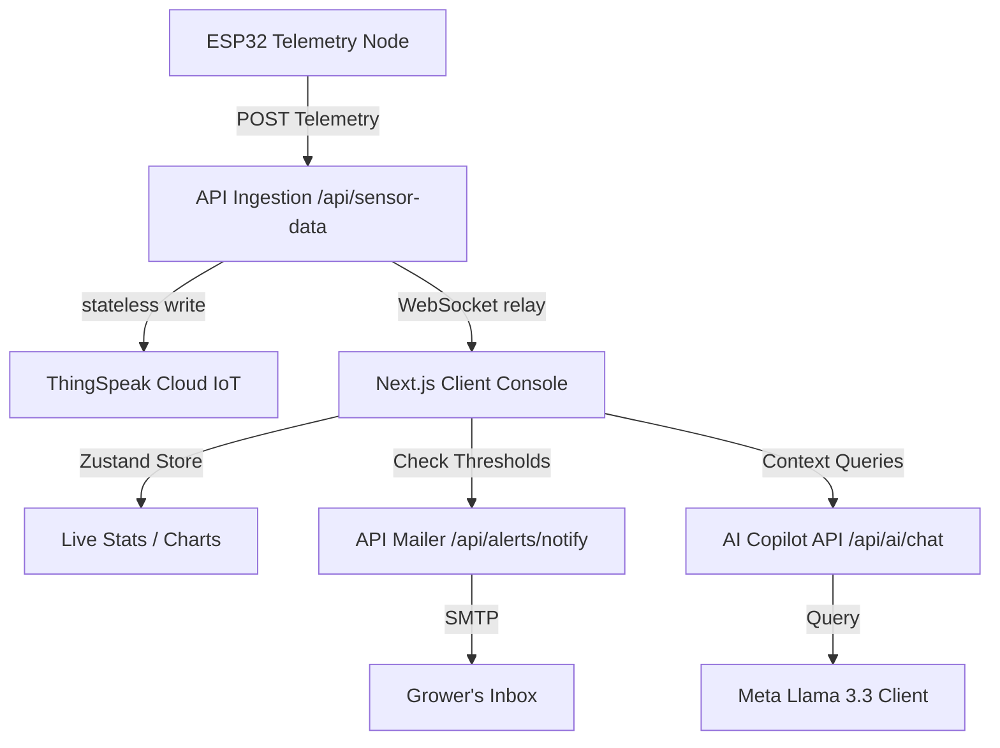

# 🌿 PulseRoot | AI Smart Plant Monitoring & Irrigation Platform

[](https://nextjs.org/)
[](https://tailwindcss.com/)
[](https://www.mongodb.com/)
[](https://nodemailer.com/)
[](https://groq.com/)

**PulseRoot** is an enterprise-grade precision agriculture operating system. It merges real-time ESP32 hardware telemetry, secure MongoDB access controls, and Cloud IoT (ThingSpeak) with dynamic LLM-driven agronomical diagnostics (Groq/OpenAI Llama 3.3). It includes automated NodeMailer email notification services and a stunning glassmorphic UI design matching the PulseRoot organic palette.

---

## 🚀 Key Features

*   📈 **Real-Time Telemetry Dashboard:** View instantaneous sensor streams and dynamic calculated historical averages (Atmospheric Temperature, Relative Humidity, Soil Moisture, and Pump state) retrieved directly from the **ThingSpeak Cloud**.
*   🤖 **AI Agronomy Copilot:** Ask questions directly to the embedded Llama-3.3-70b-versatile model to get contextual environmental insights and preventive care suggestions based on your crop's active readings.
*   📬 **SMTP NodeMailer Email Alerts:** Automated, beautifully styled HTML email notifications sent directly to the grower's inbox when environmental thresholds are breached (e.g. Critical Heat Stress, Low Soil Moisture, Prolonged Darkness).
*   ⏱️ **Anti-Spam Debounce Cooldown:** Features a built-in 15-minute debouncing cooldown mapped per alert category inside Zustand state store to keep your inbox spam-free.
*   🌿 **Plant Growth Simulator Animation:** A beautiful, custom-designed, lightweight SVG simulator in the navbar sidebar that smoothly transitions your plant from a Seed (bouncing animation) -> Sprout -> Sapling -> Mature Tree every 4 seconds.
*   🛡️ **HTTP-Only Session Security:** Fully protected routes (including `/`) backed by JWT access keys, Google OAuth 2.0 gateways, and dynamic Google Profile avatars/badged initial fallbacks.

---

## 🛠️ Architecture & Technology Stack



### Backend Services
*   **Next.js App Router & API Handlers:** Serverless backend routes for auth, registration, device control, and analytics.
*   **Socket.IO WebSocket Server:** Enables real-time, low-latency telemetry broadcasts from ESP32 nodes to the active browser context.
*   **Mongoose ODM / MongoDB:** Secures credentials hashes, user profile attributes, registered devices, and event logs.

### Frontend Interface
*   **Zustand Store:** Client state management orchestrating real-time telemetry pipelines, device selectors, notifications, and alert cooldown states.
*   **Recharts Engine:** Premium, interactive area, bar, and pie charts styled in HSL tones mapping telemetry history.
*   **Glassmorphic Design Palette:** Premium backdrop blur cards (`glass-panel`), outfit typography, and organic gradients matching branding:
    *   `Forest Green (#1C3B2B)` - Primary brand background.
    *   `Terracotta (#C86B4F)` - Secondary accents & alert banners.
    *   `Leafy Green (#4A5E2B)` - Success badges & active labels.
    *   `Off-white / Sand (#FCEDE8)` - Clean canvas gradients.

---

## ⚡ Getting Started

### 📦 Installation
1. Clone the project repository and install the dependencies:
   ```bash
   npm install
   ```

2. Establish your environmental configurations by copying the `.env.example` into a local configuration:
   ```bash
   cp .env.example .env.local
   ```

3. Fill in your environment parameters inside `.env.local`:
   ```env
   # MongoDB Database URI
   MONGODB_URI=mongodb://localhost:27017/pulseroot
   
   # JWT Security Signature Keys
   JWT_ACCESS_SECRET=your_jwt_access_signature_key_here
   JWT_REFRESH_SECRET=your_jwt_refresh_signature_key_here
   
   # ThingSpeak Cloud API Channels (Stateless Read/Write Keys)
   THINGSPEAK_CHANNEL_ID=3395390
   THINGSPEAK_READ_API_KEY=4S9RSKIB0ZESXXX0
   THINGSPEAK_WRITE_API_KEY=your_thingspeak_write_key_here
   
   # Groq AI Service API (Agri Copilot Engine)
   GROQ_API_KEY=gsk_your_groq_api_token_here
   ```

### 🔧 NodeMailer SMTP Configuration (Alert Dispatcher)
To enable active email alerts to your inbox, configure the following values inside `.env.local`. If these variables are left empty, the platform will automatically run in **Console Logger Mock Mode** (printing text transcripts of emails beautifully to the terminal logs for local testing!):
```env
# SMTP Gateway Configuration
SMTP_HOST=smtp.gmail.com
SMTP_PORT=587
SMTP_USER=your_gmail_address@gmail.com
SMTP_PASS=your_gmail_app_password_here
SMTP_FROM="PulseRoot Alert Gateway" <alerts@pulseroot.ag>
```
*Note: For Gmail, you will need to generate an **App Password** inside your Google Account Security settings.*

### 🛡️ Google OAuth 2.0 credentials (Avatar Sync)
To support seamless social credentials sign-in and sync actual Google profile avatars to your dashboard header:
```env
GOOGLE_CLIENT_ID=your_google_oauth_client_id.apps.googleusercontent.com
GOOGLE_CLIENT_SECRET=GOCSPX-your_google_oauth_client_secret_here
NEXT_PUBLIC_APP_URL=http://localhost:3000
```

---

## 🏃 Running locally

Start the development server using:
```bash
npm run dev
```

The system will start and listen on [http://localhost:3000](http://localhost:3000). 

*   Visiting the root `/` will route you to the secure **PulseRoot Authentication** gateway.
*   Once logged in (via email password or Google popup), you will be securely redirected to the `/dashboard`.
*   Click **"Back to Homepage"** inside the dashboard welcome banner to view the corporate PulseRoot landing page at `/` without getting trapped in redirect loops.

---

## 👨‍💻 Project Directory Structure

```
├── public/                 # Static graphical assets and icons
├── src/
│   ├── app/                # Next.js pages and API routing gateway
│   │   ├── ai-analysis/    # Crop Health Analytics audit report
│   │   ├── alerts/         # Active Notification logs dashboard
│   │   ├── api/            # API Route handlers (Auth, Telemetry, Chat)
│   │   ├── chatbot/        # Llama 3.3 Agronomy Copilot interface
│   │   ├── dashboard/      # Premium glassmorphic telemetry console
│   │   ├── devices/        # Registered ESP32 nodes configuration
│   │   ├── globals.css     # Tailwind v4 globals, custom glass-panels
│   │   └── layout.js       # Main frame layout wrapping AuthGate & Sidebar
│   ├── components/         # Reusable widgets and navbar animations
│   │   ├── AuthGate.js     # Security gateway (Sign-in form & OAuth)
│   │   ├── Navigation.js   # Clean, simplified sidebar with growth animation
│   │   └── PlantCanvas.js  # HTML5 Canvas 3D particle growth engine
│   ├── lib/                # Modular utilities (Store, JWT, SMTP, Groq)
│   │   ├── auth.js         # JWT credentials encoders/decoders
│   │   ├── db.js           # Mongoose ODM connection pooler
│   │   ├── emailService.js # NodeMailer SMTP compiler & HTML templates
│   │   └── useStore.js     # Zustand state store with rate-limiters
│   └── models/             # Mongoose database schemas
└── server.js               # Custom Socket.IO Express integration server
```

---

## ⚖️ License
PulseRoot is distributed under the enterprise agricultural code license. All asymmetric JWT validation pipelines and telemetry models are proprietary property of PulseRoot Systems.
# pulseroot

