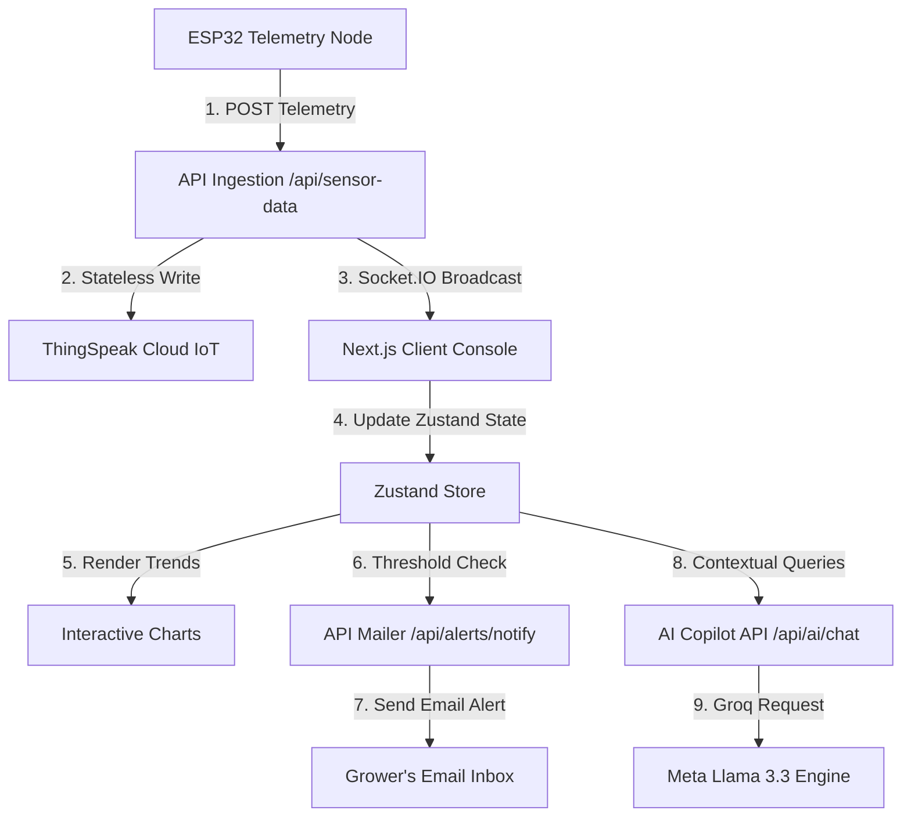

# 🌿 PulseRoot | AI Smart Plant Monitoring & Irrigation Platform

<p align="center">
  
  
  
  
  
</p>

---

## 📖 Introduction & System Overview

**PulseRoot** is a production-grade precision agriculture operating system. It bridges real-time telemetry streams from ESP32 edge nodes with automated cloud proxy storage (**ThingSpeak Cloud**) and local databases (**MongoDB**). It features a premium, responsive glassmorphic console, an AI-powered agronomy copilot utilizing Groq's **Llama-3.3-70b-versatile** model, and a robust **NodeMailer SMTP** email dispatch system that triggers structured alert templates to growers when environmental conditions cross defined critical limits.

---

## 🚀 Key Platform Capabilities

*   📈 **Real-Time Telemetry Dashboard:** Visualizes atmospheric temperature, relative humidity, soil moisture index, and pump activation indicators on dynamic Recharts trend graphs.
*   📊 **Dynamic Agronomic Averages:** Dynamically calculates averages of active environmental metrics (Average Temperature, Relative Humidity, Soil Moisture) across the selected dataset.
*   🤖 **AI Agronomist Copilot:** An embedded interactive chatbot that processes real-time telemetry variables to provide professional diagnostics and customized treatment advice.
*   📬 **NodeMailer Email Alerts:** Styled responsive HTML alert emails (in Forest Green and Terracotta accent tones) notifying growers instantly when agronomic metrics breach safe bounds.
*   ⏱️ **Built-in 15-Min Rate Limiting Cooldown:** Avoids spamming growers' inboxes by enforcing a 15-minute debouncing cooldown mapped per alert category (Heat Stress, Low Humidity, Darkness).
*   🌿 **Sidebar Growth Simulator:** A custom-styled SVG plant growth simulator that dynamically animates from Seed -> Sprout -> Sapling -> Mature Tree every 4 seconds.
*   🛡️ **HTTP-Only JWT Security Gate:** Secure cookie-based authentication, Google OAuth 2.0 popup gateway, and dynamic Google Profile picture rendering.

---

## 🛠️ System Architecture

The following diagram illustrates the complete, full-stack data flow of the PulseRoot IoT platform:



---

## ⚡ Setup & Installation

### 1. Clone & Core Dependencies
First, clone the repository to your local directory and install the required npm packages:
```bash
npm install
```

### 2. Environmental Variables Configuration
Create a `.env.local` configuration file in the root directory:
```bash
cp .env.example .env.local
```

Open `.env.local` and configure your credentials:
```env
# MongoDB Database URI Connection
MONGODB_URI=mongodb://localhost:27017/pulseroot

# JWT Security Gate Tokens
JWT_ACCESS_SECRET=your_jwt_access_signature_key_here
JWT_REFRESH_SECRET=your_jwt_refresh_signature_key_here

# ThingSpeak IoT Cloud stateless Read/Write channels
THINGSPEAK_CHANNEL_ID=3395390
THINGSPEAK_READ_API_KEY=4S9RSKIB0ZESXXX0
THINGSPEAK_WRITE_API_KEY=your_thingspeak_write_key_here

# Groq AI Service API key (Agronomy Copilot)
GROQ_API_KEY=gsk_your_groq_api_token_here
```

### 3. NodeMailer SMTP Configuration (Alert Dispatcher)
To active real-time email warning dispatches, configure the SMTP transport credentials inside your `.env.local`. If these fields are left empty, the platform will gracefully fall back to **Console Logger Mock Mode** (printing text alert templates safely to your server terminal output):
```env
# SMTP Gateway Configuration
SMTP_HOST=smtp.gmail.com
SMTP_PORT=587
SMTP_USER=your_gmail_address@gmail.com
SMTP_PASS=your_gmail_app_password_here
SMTP_FROM="PulseRoot Alert Gateway" <alerts@pulseroot.ag>
```
*Note: For Gmail setups, you must generate an **App Password** inside Google Account Security.*

### 4. Google OAuth 2.0 App Gateway (Avatar Sync)
To support seamless social logins and sync verified profile pictures to your dashboard header:
```env
GOOGLE_CLIENT_ID=your_google_oauth_client_id.apps.googleusercontent.com
GOOGLE_CLIENT_SECRET=GOCSPX-your_google_oauth_client_secret_here
NEXT_PUBLIC_APP_URL=http://localhost:3000
```

---

## 🚀 Running the Platform Locally

Start the development server using:
```bash
npm run dev
```

*   Open [http://localhost:3000](http://localhost:3000) inside your web browser.
*   You will be redirected automatically by the `AuthGate` to sign in.
*   Upon successful authorization, the server securely transitions you to the `/dashboard`.
*   Click **"Back to Homepage"** on the dashboard welcome banner to navigate back and browse the marketing layout safely without looping.

---

## 📁 Repository File Layout

```
├── public/                 # Static graphical assets and icons
├── src/
│   ├── app/                # Next.js App Router & API Route handlers
│   │   ├── ai-analysis/    # Crop Health Analytics audit report
│   │   ├── alerts/         # Active Notification logs dashboard
│   │   ├── api/            # API Route handlers (Auth, Telemetry, Chat)
│   │   ├── chatbot/        # Llama 3.3 Agronomy Copilot interface
│   │   ├── dashboard/      # Premium glassmorphic telemetry console
│   │   ├── devices/        # Registered ESP32 nodes configuration
│   │   ├── globals.css     # Tailwind v4 globals, custom glass-panels
│   │   └── layout.js       # Main frame layout wrapping AuthGate & Sidebar
│   ├── components/         # Reusable UI widgets and layout animations
│   │   ├── AuthGate.js     # Security gateway (Sign-in form & OAuth)
│   │   ├── Navigation.js   # Clean, simplified sidebar with growth animation
│   │   └── PlantCanvas.js  # HTML5 Canvas 3D particle growth engine
│   ├── lib/                # Middleware utilities and core connectors
│   │   ├── auth.js         # JWT credentials encoder/decoders
│   │   ├── db.js           # Mongoose ODM connection pooler
│   │   ├── emailService.js # NodeMailer SMTP compiler & HTML templates
│   │   └── useStore.js     # Zustand state store with rate-limiters
│   └── models/             # Mongoose database schemas
└── server.js               # Custom Socket.IO Express integration server
```

---

## ⚖️ License
PulseRoot is distributed under the enterprise agricultural code license. All asymmetric JWT validation pipelines and telemetry models are proprietary property of PulseRoot Systems.